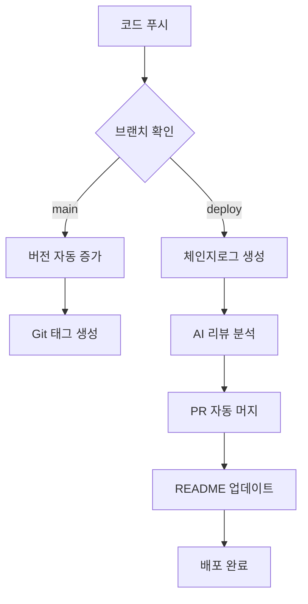

# 🚀 SUH-DEVOPS-TEMPLATE
**완전 자동화된 GitHub 프로젝트 관리 템플릿**

> **개발자는 코드만 작성하세요. 버전 관리, 체인지로그, 배포는 우리가 자동으로 처리합니다.**

<!-- AUTO-VERSION-SECTION: DO NOT EDIT MANUALLY -->
<!-- 이 섹션은 .github/workflows/PROJECT-README-VERSION-UPDATE.yaml에 의해 자동으로 업데이트됩니다 -->
<!-- 수정하지마세요 자동으로 동기화 됩니다 -->
## 최신 버전 : v2.5.0 (2026-01-08)
[전체 버전 기록 보기](CHANGELOG.md)
<!-- END-AUTO-VERSION-SECTION -->

---

## 🎯 이 템플릿이 필요한 이유

매번 새 프로젝트를 시작할 때마다 반복하는 지루한 작업들:
- ❌ 버전 관리 시스템 구축
- ❌ CI/CD 파이프라인 설정
- ❌ 체인지로그 수동 작성
- ❌ GitHub Actions 워크플로우 작성
- ❌ 이슈/PR 템플릿 설정

**이 모든 것을 5분 안에 자동으로!** ✨

---

## 🚀 2가지 사용 방법

### 방법 1: 새 프로젝트 시작 (GitHub 템플릿 사용)

**가장 쉬운 방법! GitHub에서 템플릿으로 프로젝트 생성**

```bash
# 1️⃣ GitHub에서 "Use this template" 버튼 클릭
#    → 새 저장소 생성됨

# 2️⃣ 자동 초기화 완료!
#    ✅ basic 타입으로 자동 설정
#    ✅ 공통 워크플로우 5개 자동 설치:
#       - 버전 자동 관리
#       - README 버전 자동 업데이트  
#       - 체인지로그 자동 생성
#       - 이슈 자동 댓글
#       - 라벨 자동 동기화
#    ✅ version.yml 자동 생성
#    ✅ README 초기화 완료

# 3️⃣ 클론하고 바로 개발 시작!
git clone https://github.com/your-username/your-project.git
cd your-project

# 🎉 완료! 코드 푸시하면 모든 자동화 작동
```

**자동 초기화 과정**:
- 🤖 PROJECT-TEMPLATE-INITIALIZER 워크플로우가 자동 실행
- ⚡ 1분 이내 완료 (이슈 0개 + 저장소 생성 1시간 이내 조건)
- ✅ basic 타입, v0.0.0으로 시작
- 🗑️ 템플릿 전용 파일 자동 삭제

### 방법 2: 📦 기존 프로젝트에 통합 (원격 스크립트 실행)

**이미 진행 중인 프로젝트에 템플릿 기능 추가**

#### 🐧 macOS / Linux
- 한 줄 명령어로 즉시 설치! (대화형 모드 - 자동 감지)
```bash
bash <(curl -fsSL "https://raw.githubusercontent.com/Cassiiopeia/SUH-DEVOPS-TEMPLATE/main/template_integrator.sh")
```

#### 🪟 Windows (PowerShell)
- PowerShell에서 한 줄 명령어로 즉시 설치! (대화형 모드 - 자동 감지)
```powershell
iex (iwr -Uri "https://raw.githubusercontent.com/Cassiiopeia/SUH-DEVOPS-TEMPLATE/main/template_integrator.ps1" -UseBasicParsing).Content
```

**또는** (실행 정책 우회):
```powershell
powershell -ExecutionPolicy Bypass -Command "iex (iwr -Uri 'https://raw.githubusercontent.com/Cassiiopeia/SUH-DEVOPS-TEMPLATE/main/template_integrator.ps1' -UseBasicParsing).Content"
```

> 💡 **대화형 모드**: 프로젝트 타입과 버전을 자동으로 감지하고, 필요 시 수정할 수 있습니다!

**대화형 모드로 쉽게 설정**:
```bash
1️⃣ 프로젝트 타입 자동 감지
   → Spring Boot 감지됨! (build.gradle 발견)

2️⃣ 버전 정보 자동 감지
   → 현재 버전: 1.2.3 (build.gradle에서 읽음)

3️⃣ 설치할 기능 선택
   [ ] 전체 통합 (버전관리 + 워크플로우 + 이슈템플릿)
   [ ] 버전 관리 시스템만
   [ ] GitHub Actions 워크플로우만
   [ ] 이슈/PR 템플릿만
   [ ] Custom Command만 (Cursor/Claude 설정)

4️⃣ 자동 설치 완료!
   ✅ Spring Boot 전용 워크플로우 8개 설치
   ✅ 공통 워크플로우 5개 설치
   ✅ version.yml 생성
   ✅ README에 버전 섹션 추가
```

**CLI 모드 (자동화/CI-CD용 - 대화 없이 실행)**:

🐧 **macOS / Linux**:
- 전체 통합 (타입/버전 자동 감지 + 확인 없이 실행)
```bash
bash <(curl -fsSL "https://raw.githubusercontent.com/Cassiiopeia/SUH-DEVOPS-TEMPLATE/main/template_integrator.sh") --mode full --force
```
- 특정 타입 지정 (수동 설정)
```bash
bash <(curl -fsSL "https://raw.githubusercontent.com/Cassiiopeia/SUH-DEVOPS-TEMPLATE/main/template_integrator.sh") \
  --mode full --type spring --version 1.0.0 --force
```

🪟 **Windows (PowerShell)**:
- 전체 통합 (타입/버전 자동 감지 + 확인 없이 실행)
```powershell
iex "& { $(iwr -Uri 'https://raw.githubusercontent.com/Cassiiopeia/SUH-DEVOPS-TEMPLATE/main/template_integrator.ps1' -UseBasicParsing).Content } -Mode full -Force"
- 특정 타입 지정 (수동 설정)
```powershell
iex "& { $(iwr -Uri 'https://raw.githubusercontent.com/Cassiiopeia/SUH-DEVOPS-TEMPLATE/main/template_integrator.ps1' -UseBasicParsing).Content } -Mode full -Type spring -Version '1.0.0' -Force"
```

> ⚠️ **CLI 모드는 자동화 환경에서만 사용하세요!** 일반 사용자는 대화형 모드를 권장합니다.

---

## 📚 문서 가이드

| 문서 | 설명 |
|------|------|
| [SUH-DEVOPS-TEMPLATE-SETUP-GUIDE.md](SUH-DEVOPS-TEMPLATE-SETUP-GUIDE.md) | 🚀 **빠른 시작**: 프로젝트 초기 설정 가이드 |
| [CONTRIBUTING.md](CONTRIBUTING.md) | 🤝 **기여 가이드**: 개발 환경 설정, 코드 스타일, PR 프로세스 |
| [CHANGELOG.md](CHANGELOG.md) | 📝 **변경 이력**: 버전별 변경사항 (자동 생성) |
| [docs/TEMPLATE-INTEGRATOR.md](docs/TEMPLATE-INTEGRATOR.md) | 🔧 **통합 스크립트**: template_integrator 상세 가이드 |

---

## 🌟 핵심 특징 

**개발자를 위한 완전 자동화된 DevOps 솔루션**

이 템플릿은 단순한 워크플로우를 넘어서, **AI 기반 자동화**와 **지능적인 프로젝트 관리**를 제공하는 차세대 GitHub 템플릿입니다.

### 🤖 AI 기반 완전 자동화
- **CodeRabbit AI** 통합으로 PR 제목 자동 포맷팅
- AI 리뷰 내용 기반 지능적 체인지로그 생성
- 외부 API 연동을 통한 이슈 자동 관리
- 프로젝트 타입 자동 감지 및 맞춤형 빌드

### ⚡ 제로 설정 워크플로우
- **한 번의 스크립트 실행**으로 완전한 DevOps 환경 구축
- **동적 브랜치 감지**: main, master, develop 등 자동 지원
- 다양한 프로젝트 타입 자동 지원 (Spring, Flutter, React, Node.js 등)
- 기존 프로젝트에 **무중단 통합** 가능

### 🎯 생산성 극대화
- 버전 관리부터 배포까지 **완전 무인 자동화**
- 수동 작업 **90% 이상 제거**
- 개발자는 코드 작성에만 집중
- 팀 협업 효율성 대폭 향상

---

## 🚀 주요 자동화 기능

### 1. 🏷️ 지능적 버전 관리 시스템

**완전 자동화된 의존성 없는 버전 관리**

- ✅ **무중단 자동 증가**: 코드 푸시 시 자동으로 패치 버전 증가 (1.0.0 → 1.0.1)
- ✅ **멀티 프로젝트 지원**: Spring, Flutter, React Native, Node.js 등 자동 감지
- ✅ **충돌 자동 해결**: 버전 불일치 시 "높은 버전 우선" 정책으로 자동 동기화
- ✅ **듀얼 플랫폼 지원**: React Native의 iOS/Android 버전 동시 관리
- ✅ **Git 태그 자동화**: 의미있는 태그 자동 생성 및 릴리즈 관리

```bash
# 지원하는 버전 파일들
- build.gradle (Spring Boot)
- pubspec.yaml (Flutter)
- package.json (React/Node.js)
- ios/Runner.xcodeproj/project.pbxproj (React Native iOS)
- android/app/build.gradle (React Native Android)
- app.json (Expo)
- pyproject.toml (Python/FastAPI/Django)
```

### 2. 🤖 AI 기반 문서화 자동화

**CodeRabbit AI와 완전 통합된 지능적 문서 관리**

- ✅ **AI 체인지로그**: CodeRabbit 리뷰를 기반으로 한 고품질 체인지로그 자동 생성
- ✅ **PR 제목 자동 포맷팅**: `🚀 Deploy YYYYMMDD-v버전 : 요약` 형식으로 AI가 자동 변경
- ✅ **카테고리 자동 분류**: Features, Bug Fixes, Documentation, Performance 등 자동 분류
- ✅ **이중 형식 지원**: JSON(데이터) + Markdown(가독성) 동시 생성
- ✅ **릴리즈 노트 내보내기**: 특정 버전의 변경사항을 다양한 형식으로 추출

### 3. 🎯 스마트 이슈 관리 시스템

**외부 API 연동을 통한 지능적 이슈 처리**

- ✅ **자동 브랜치 가이드**: 새 이슈 생성 시 권장 브랜치명과 커밋 메시지 자동 제안
- ✅ **외부 서비스 연동**: `lab.suhsaechan.me` API 통합으로 확장된 이슈 관리
- ✅ **라벨 동기화**: 저장소 간 일관된 이슈 라벨 자동 동기화
- ✅ **템플릿 자동화**: 이슈 템플릿 자동 설정 및 관리 (기능개발, 버그, 디자인, QA)
- ✅ **QA 이슈 봇**: 이슈/PR 댓글에서 `@suh-lab create qa` 멘션 시 QA 템플릿 자동 생성

### 4. 🏗️ 멀티 플랫폼 빌드 시스템

**프로젝트 타입 자동 감지 및 최적화된 빌드**

- ✅ **조건부 빌드 매트릭스**: 프로젝트 타입에 따른 동적 빌드 환경 구성
- ✅ **플랫폼별 최적화**: Windows, macOS, Ubuntu 환경별 최적화된 빌드
- ✅ **아티팩트 자동 관리**: 빌드 결과물 자동 수집 및 배포
- ✅ **수동 실행 지원**: `workflow_dispatch`를 통한 수동 빌드 트리거

### 5. 🔄 완전 자동화된 배포 파이프라인

**인간 개입 최소화된 배포 시스템**

- ✅ **브랜치 기반 자동 배포**: `deploy` 브랜치 푸시 시 자동 배포 시작
- ✅ **환경별 설정 관리**: 개발/테스트/운영 환경 자동 구분
- ✅ **실시간 모니터링**: 배포 과정 추적 및 상태 알림
- ✅ **README 자동 업데이트**: 배포 완료 시 버전 정보 자동 반영

---

## ⚡ 설치 후 추가 설정 (선택사항)

### 🔐 GitHub Token 설정 (고급 기능 사용 시)

**자동 체인지로그, PR 자동 머지 등을 사용하려면 토큰 필요**

```bash
1. GitHub → Settings → Developer settings 
   → Personal access tokens (Classic)

2. 토큰 생성
   - Name: _GITHUB_PAT_TOKEN
   - Scopes: ✅ repo, ✅ workflow

3. Repository Settings → Secrets and variables → Actions
   → New repository secret
   - Name: _GITHUB_PAT_TOKEN
   - Value: [생성한 토큰 붙여넣기]
```

---

## 🎮 지원하는 프로젝트 타입

### 백엔드
- **`spring`**: Spring Boot (Gradle/Maven) + Nexus CI/CD
- **`node`**: Node.js / Express / Fastify
- **`python`**: FastAPI / Django / Flask

### 프론트엔드  
- **`react`**: React.js / Next.js 웹
- **`react-native`**: React Native CLI
- **`react-native-expo`**: Expo 기반 RN

### 모바일/기타
- **`flutter`**: Flutter 멀티 플랫폼
- **`basic`**: 범용 타입 (버전 관리만)

**각 타입마다 전용 CI/CD 워크플로우 제공!**

---

## 🤖 자동화 워크플로우 상세

### 📊 브랜치별 트리거 시스템

| 브랜치 | 트리거 | 자동화 동작 | 결과 |
|--------|--------|-------------|------|
| **`main`** | `push` | 🏷️ 버전 자동 증가 | Git 태그 생성 |
| **`deploy`** | `PR 생성` | 📝 AI 체인지로그 생성 | PR 자동 머지 |
| **`deploy`** | `push` | 📊 README 버전 업데이트 | 양방향 동기화 |
| **모든 브랜치** | `수동 실행` | 🏗️ 빌드 & 테스트 | 아티팩트 생성 |

### 🔄 완전 자동화 플로우



### 🎯 핵심 자동화 특징

**🔥 AI 기반 PR 제목 자동 변경**
- CodeRabbit이 PR 제목을 `🚀 Deploy YYYYMMDD-v1.0.1 : 새로운 기능 추가` 형식으로 자동 변경
- 일관된 릴리즈 노트 형식 유지

**🔥 외부 API 연동 이슈 관리**
- 새 이슈 생성 시 `lab.suhsaechan.me` API 호출
- 권장 브랜치명과 커밋 메시지 자동 제안

**🔥 지능적 충돌 해결**
- 여러 버전 파일 간 불일치 시 "높은 버전 우선" 정책 적용
- 수동 개입 없이 자동 동기화

---

## 🛠️ 고급 스크립트 활용

### version_manager.sh v2.0 🚀

**차세대 버전 관리 스크립트**

```bash
# 📊 현재 버전 확인 (모든 파일 상태 표시)
.github/scripts/version_manager.sh get

# 🔼 패치 버전 자동 증가 (1.0.0 → 1.0.1)
.github/scripts/version_manager.sh increment

# 🎯 특정 버전으로 일괄 설정
.github/scripts/version_manager.sh set 2.0.0

# 🔄 버전 동기화 (충돌 자동 해결)
.github/scripts/version_manager.sh sync

# 📋 지원하는 모든 버전 파일 목록
.github/scripts/version_manager.sh list-files
```

**고급 기능**
- ✅ **충돌 자동 해결**: "높은 버전 우선" 정책
- ✅ **React Native 듀얼 지원**: iOS/Android 버전 동시 관리
- ✅ **포괄적 로깅**: 모든 변경사항 상세 기록
- ✅ **에러 복구**: 실패 시 자동 롤백

### changelog_manager.py v2.0 🤖

**AI 통합 체인지로그 관리자**

```bash
# 🤖 CodeRabbit 리뷰 내용으로 체인지로그 업데이트
python3 .github/scripts/changelog_manager.py update-from-summary

# 📝 Markdown 체인지로그 재생성
python3 .github/scripts/changelog_manager.py generate-md

# 📤 특정 버전 릴리즈 노트 추출
python3 .github/scripts/changelog_manager.py export --version 1.2.3 --output release_notes.txt

# 🔄 이중 파싱 전략으로 호환성 보장
python3 .github/scripts/changelog_manager.py validate
```

**AI 기반 기능**
- ✅ **이중 파싱 전략**: 최신/레거시 CodeRabbit 형식 모두 지원
- ✅ **HTML 파싱**: 복잡한 리뷰 내용 정확 추출
- ✅ **JSON + Markdown**: 구조화된 데이터와 가독성 동시 제공
- ✅ **내보내기**: 릴리즈 노트 다양한 형식으로 추출

### 📱 Flutter CI/CD 시스템

**Flutter 프로젝트를 위한 완전 자동화된 배포 파이프라인**

#### 마법사 도구

| 마법사 | 설명 | 상세 가이드 |
|--------|------|------------|
| **TestFlight 마법사** | iOS 배포 설정 자동 생성 (ExportOptions.plist, Fastfile) | [가이드](docs/FLUTTER-TESTFLIGHT-WIZARD.md) |
| **Play Store 마법사** | Android 배포 설정 자동 생성 (Fastfile, 서명 설정) | [가이드](docs/FLUTTER-PLAYSTORE-WIZARD.md) |

#### 테스트 빌드 트리거

PR/이슈에 `@suh-lab build app` 댓글 작성 → Android APK + iOS TestFlight 자동 빌드

| 기능 | 설명 |
|------|------|
| **트리거 키워드** | `@suh-lab build app` |
| **지원 컨텍스트** | PR, 이슈 |
| **빌드 결과** | 자동 댓글 작성 (성공/실패, 다운로드 링크) |
| **버전 형식** | `0.0.0(빌드번호)` - 테스트 전용 |

상세 가이드: [테스트 빌드 트리거](docs/FLUTTER-TEST-BUILD-TRIGGER.md)

#### 워크플로우 목록

| 워크플로우 | 용도 | 트리거 |
|-----------|------|--------|
| `PROJECT-FLUTTER-IOS-TESTFLIGHT` | iOS 본 배포 | deploy 브랜치 |
| `PROJECT-FLUTTER-ANDROID-PLAYSTORE-CICD` | Android 본 배포 | deploy 브랜치 |
| `PROJECT-FLUTTER-IOS-TEST-TESTFLIGHT` | iOS 테스트 빌드 | 댓글 트리거 |
| `PROJECT-FLUTTER-ANDROID-TEST-APK` | Android 테스트 APK | 댓글 트리거 |

> 📚 **전체 가이드**: [Flutter CI/CD 전체 가이드](docs/FLUTTER-CICD-OVERVIEW.md)

---

## 🔧 조직 및 팀 설정

### Organization 저장소 필수 설정
**⚠️ 중요: Organization 설정이 올바르지 않으면 자동화가 작동하지 않습니다**

#### 1. Actions 권한 설정
```
Settings → Actions → General
├── ✅ Allow GitHub Actions to create and approve pull requests
├── ✅ Allow GitHub Actions to merge pull requests  
└── ✅ Allow auto-merge
```

#### 2. Member 권한 설정
```
Settings → Member privileges
├── 🔧 Personal access token expiration policy (적절히 설정)
├── ✅ Base permissions: Read (최소)
└── ✅ Allow forking of private repositories (필요시)
```

#### 3. Pull Request 설정
```
Settings → General → Pull Requests
├── ✅ Allow auto-merge
├── ✅ Allow squash merging
└── ✅ Automatically delete head branches
```

### 개인 저장소 권장 설정

```
Settings → General
├── ✅ Allow auto-merge
├── ✅ Automatically delete head branches
└── 🔧 Default branch: main (또는 프로젝트 기본 브랜치)
```

---

## 🚨 트러블슈팅

### 🔴 자주 발생하는 문제들

#### 1. GitHub 토큰 권한 오류
```
❌ remote: Permission to ... denied to github-actions[bot]
```
**해결 방법:**
- `_GITHUB_PAT_TOKEN`이 **Classic** 토큰인지 확인
- `repo`, `workflow` 권한 모두 체크
- Organization 저장소: Organization 설정에서 PAT 정책 확인

#### 2. 워크플로우 실행 안됨
```
❌ This workflow was not executed
```
**해결 방법:**
- `deploy` 브랜치에 모든 워크플로우 파일 존재 확인
- Branch protection rule이 너무 엄격한지 확인
- Organization Actions 설정 확인

#### 3. 버전 동기화 실패
```
❌ Version conflict detected
```
**해결 방법:**
- 모든 버전 파일의 형식이 올바른지 확인
- 수동으로 한 번 동기화: `./github/scripts/version_manager.sh sync`

#### 4. 스크립트 실행 권한 오류
```
❌ bash: permission denied
```
**해결 방법:**
```bash
chmod +x .github/scripts/version_manager.sh
chmod +x .github/scripts/changelog_manager.py
```

### 🛠️ 고급 디버깅

#### 워크플로우 실행 로그 확인
```
GitHub Actions → 해당 워크플로우 → 실패한 작업 클릭
```

#### 버전 파일 상태 진단
```bash
# 모든 버전 파일 상태 확인
.github/scripts/version_manager.sh get --verbose

# 충돌 감지 및 해결
.github/scripts/version_manager.sh sync --dry-run
```

---

## 📈 성능 및 효과

### 🎯 정량적 효과
- **수동 작업 시간 90% 절감**: 버전 관리부터 배포까지 완전 자동화
- **배포 주기 50% 단축**: 자동화된 파이프라인으로 빠른 배포
- **실수 95% 감소**: 수동 실수 요소 제거

### 🏆 정성적 효과
- **개발 집중도 향상**: 개발자는 코드 작성에만 집중
- **팀 협업 효율성**: 일관된 프로세스로 팀 전체 생산성 향상
- **품질 안정성**: AI 기반 문서화로 릴리즈 품질 향상

---

## 🌟 커뮤니티 및 지원

### 🤝 기여하기
이 프로젝트는 오픈소스입니다! 기여를 환영합니다.

- 📋 [이슈 생성하기](https://github.com/Cassiiopeia/suh-github-template/issues/new/choose)
- 🔧 [기여 가이드라인](https://github.com/Cassiiopeia/suh-github-template/blob/main/CONTRIBUTING.md)
- 💡 새로운 프로젝트 타입 제안
- 🐛 버그 리포트 및 개선 제안

### 📞 지원 및 문의

**빠른 응답:**
- 📧 이메일: chan4760@naver.com
- 🎫 GitHub Issues: 기술적 문제 및 기능 요청
- 💬 토론: 프로젝트 관련 일반적인 질문

**응답 시간:** 평균 24시간 이내

---

## 📜 라이선스

이 프로젝트는 MIT 라이선스 하에 제공됩니다. 자유롭게 사용, 수정, 배포하실 수 있습니다.

---

### 모든 사용자 공통
- 📢 팀원들과 워크플로우 공유
- 💡 개선사항/문제점 이슈로 제보
- ⭐ 도움이 되었다면 Star 부탁드립니다!

**🎉 이제 개발에만 집중하세요! 나머지는 자동화가 처리합니다.**
